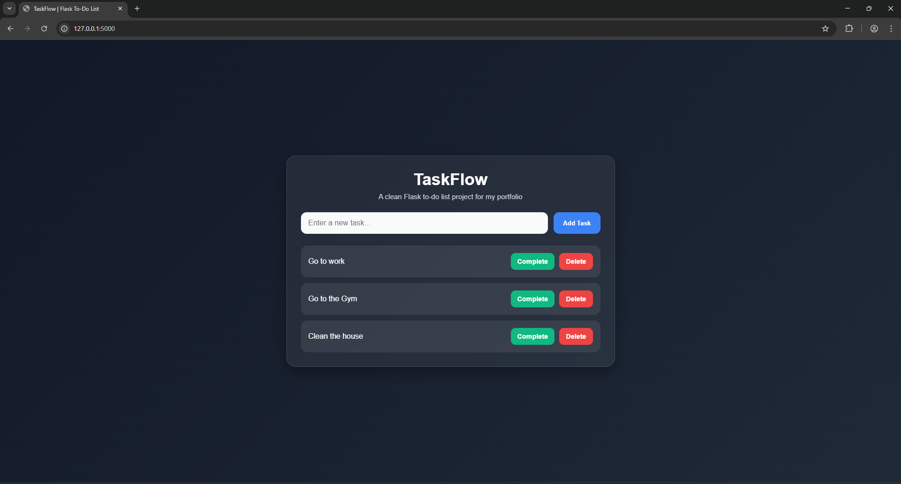

# Flask To-Do List

A clean and responsive to-do list web app built with Flask, Python, HTML, CSS, and JSON storage.

## Preview

## Features
- Add tasks
- Mark tasks as complete
- Undo completed tasks
- Delete tasks
- Responsive design for desktop and mobile

## Tech Used
- Python
- Flask
- HTML
- CSS
- JSON

## How to Run

1. Clone the repository
2. Install Flask: pip install flask
3. Run the app: python app.py
4. Open your browser and go to: http://127.0.0.1:5000
